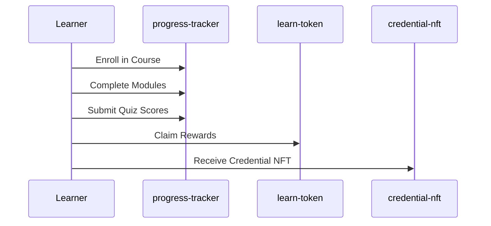
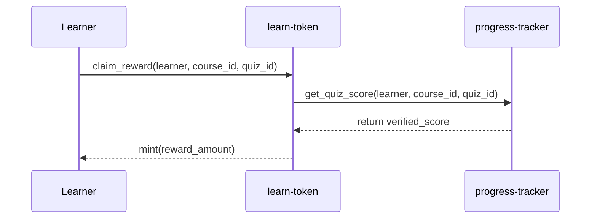
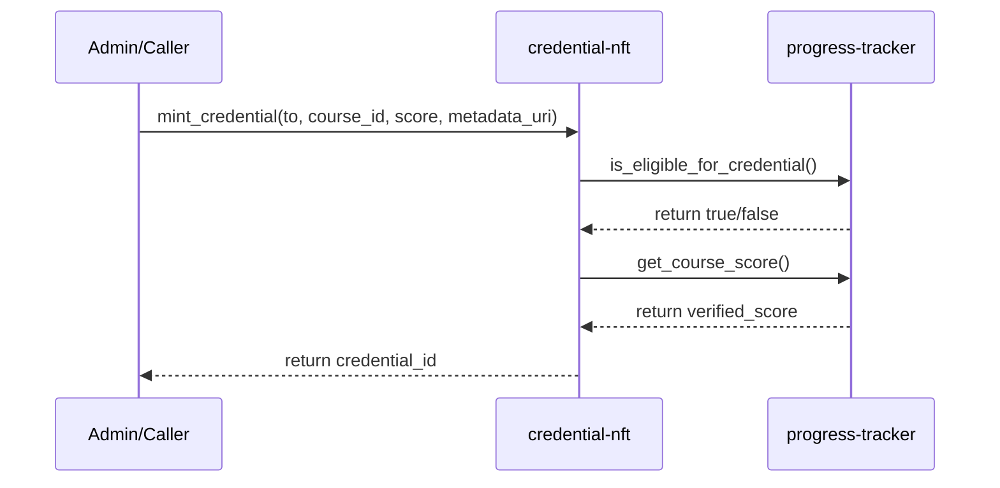

# Architecture

ChainLearn is a Soroban smart contract workspace for a Stellar-based learning platform. This document describes the contract relationships, data flow, and storage layout.

## Contract Relationships

```
┌─────────────────────────────────────────────────────────────────────────────┐
│                           ChainLearn Architecture                           │
├─────────────────────────────────────────────────────────────────────────────┤
│                                                                             │
│  ┌──────────────────┐                                                      │
│  │   progress-      │◄─────────────────────────────────────────────────┐   │
│  │   tracker        │                                                  │   │
│  │                  │  get_quiz_score()                                │   │
│  │  • enroll()      │◄────────────────────────┐                       │   │
│  │  • complete_     │                          │                       │   │
│  │    module()      │  is_eligible_for_        │                       │   │
│  │  • submit_quiz_  │    credential()          │                       │   │
│  │    score()       │◄─────────────────────┐   │                       │   │
│  │  • get_progress()│   get_course_score() │   │                       │   │
│  └──────────────────┘                      │   │                       │   │
│          ▲                                 │   │                       │   │
│          │                                 │   │                       │   │
│          │ creates                         │   │                       │   │
│          │                                 │   │                       │   │
│  ┌───────┴───────┐                         │   │                       │   │
│  │   Admin       │                         │   │                       │   │
│  │   (Stellar    │─────────────────────────┼───┼───────────────────────┘   │
│  │    Account)   │                         │   │                           │
│  └───────────────┘                         │   │                           │
│          │                                 │   │                           │
│          │ deploys & initializes           │   │                           │
│          ▼                                 ▼   ▼                           │
│  ┌──────────────────┐           ┌──────────────────┐                      │
│  │   learn-token    │           │  credential-nft  │                      │
│  │                  │           │                  │                      │
│  │  • claim_reward()│           │  • mint_         │                      │
│  │  • mint()        │           │    credential()  │                      │
│  │  • transfer()    │           │  • verify_       │                      │
│  │  • burn()        │           │    credential()  │                      │
│  └──────────────────┘           │  • revoke_       │                      │
│                                 │    credential()  │                      │
│                                 └──────────────────┘                      │
│                                                                             │
└─────────────────────────────────────────────────────────────────────────────┘
```

### Cross-Contract Dependencies

- **learn-token** calls **progress-tracker** to verify quiz scores before minting rewards
- **credential-nft** calls **progress-tracker** to verify course completion before minting credentials
- Both contracts must be initialized with the **progress-tracker** contract address

## Data Flow

### Learner Journey



### Reward Claim Flow



### Credential Mint Flow



## Storage Layout

### progress-tracker Storage

| Key Pattern | Type | Description |
|-------------|------|-------------|
| `Admin` | `Address` | Contract administrator |
| `Course(course_id)` | `Course` | Course configuration |
| `Progress(learner, course_id)` | `ProgressInfo` | Learner progress aggregates |
| `ModuleCompleted(learner, course_id, module_id)` | `bool` | Module completion flag |
| `QuizResult(learner, course_id, quiz_id)` | `QuizResult` | Individual quiz scores |
| `LearnerCourses(learner)` | `Vec<Symbol>` | Index of enrolled courses |

### learn-token Storage

| Key Pattern | Type | Description |
|-------------|------|-------------|
| `Admin` | `Address` | Contract administrator |
| `Name`, `Symbol`, `Decimal` | `String`, `u32` | Token metadata |
| `TotalSupply` | `i128` | Current token supply |
| `MaxSupply` | `i128` | Maximum supply cap |
| `Balance(address)` | `i128` | Token balance |
| `Allowance(owner, spender)` | `AllowanceData` | Spending allowance |
| `RewardClaimed(learner, course_id, quiz_id)` | `bool` | Double-claim prevention |
| `ProgressTracker` | `Address` | Progress tracker address |

### credential-nft Storage

| Key Pattern | Type | Description |
|-------------|------|-------------|
| `Admin` | `Address` | Contract administrator |
| `ProgressTracker` | `Address` | Progress tracker address |
| `Credential(id)` | `CredentialInfo` | Credential data |
| `LearnerCredentials(learner)` | `Vec<u64>` | Learner's credential IDs |
| `CourseCredentials(course_id)` | `Vec<u64>` | Course's credential IDs |
| `CredentialCounter` | `u64` | Total credentials minted |

## Shared Package

The `chainlearn-shared` package provides common types and constants:

- `MIN_CREDENTIAL_SCORE` (50): Minimum score for credential eligibility
- `MAX_QUIZ_SCORE` (100): Maximum quiz score
- `TOKEN_DECIMALS` (7): Token decimal places
- `BASE_REWARD_PER_POINT` (100): Tokens per quiz point
- `MAX_CREDENTIALS_PAGE_SIZE` (50): Pagination limit

## Security Model Summary

- All state-changing functions require authorization
- Cross-contract calls verify on-chain progress before rewards/credentials
- Double-claim prevention via per-quiz tracking
- Soulbound (non-transferable) credentials
- Admin-only operations for sensitive actions
- Emergency pause capability

## Related Documentation

- [Security Model](./security.md)
- [Upgrade Guide](./upgrade-guide.md)
- [Integration Guide](./integration-guide.md)