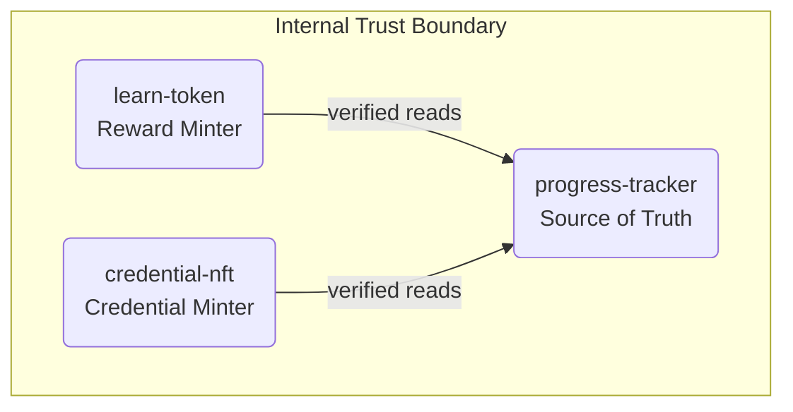

# Security Model

This document describes the security model, trust boundaries, threat model, and mitigation strategies for ChainLearn smart contracts.

## Authorization Model

### Role-Based Access Control

ChainLearn uses role-based access control with the following roles:

| Role | Permissions | Functions |
|------|-------------|-----------|
| **Admin** | Full administrative access | `initialize`, `transfer_admin`, `pause`, `unpause`, `upgrade` |
| **Minter** | Token minting | `mint` (learn-token only) |
| **Pauser** | Emergency pause/unpause | `pause`, `unpause` |
| **User** | Standard operations | `enroll`, `complete_module`, `submit_quiz_score`, `claim_reward` |

### Authorization Patterns

```rust
// Direct authorization - requires the caller to prove ownership
learner.require_auth();

// Role-based authorization - checks for specific admin role
let admin = storage::get_admin(&env);
admin.require_auth();
if !storage::has_role(&env, &caller, &AdminRole::Minter) {
    panic!("not authorized");
}
```

### Multi-Sig Operations

Critical operations require multi-signature authorization:

- **upgrade_multisig**: Requires two distinct admin signatures
- **execute_multisig_op**: Generic multi-sig operation execution

```rust
// Both callers must be admins and distinct
caller.require_auth();
co_signer.require_auth();
if caller == co_signer {
    panic!("distinct co-signer required");
}
```

## Trust Boundaries

### External Trust Boundaries

```mermaid
graph TD
    subgraph External Trust Boundary
        Stellar[Stellar Network]
        Callers[External Callers]
        Storage[Off-chain Storage]
    end

    subgraph ChainLearn Contracts
        Checks[Auth checks on all state changes]
        Validation[Input validation bounds, duplicates]
        Verification[Cross-contract verification]
    end

    Stellar --> ChainLearn Contracts
    Callers --> ChainLearn Contracts
    Storage --> ChainLearn Contracts
```

### Internal Trust Boundaries



## Threat Model

### 1. Unauthorized Token Minting

**Threat**: Attacker mints tokens without completing quizzes.

**Mitigation**:
- `claim_reward` queries `progress-tracker.get_quiz_score()` directly
- Score cannot be supplied by the caller
- Each quiz can only be claimed once per learner

```rust
// Score is fetched from progress-tracker, not provided by caller
let score = Self::fetch_quiz_score(&env, &progress_tracker, ...);
let reward_amount = (score as i128) * BASE_REWARD_PER_POINT;
```

### 2. Credential Fraud

**Threat**: Attacker mints credential without course completion.

**Mitigation**:
- `mint_credential` calls `progress-tracker.is_eligible_for_credential()`
- Score must match `progress-tracker.get_course_score()` exactly
- One credential per learner per course

```rust
// Eligibility verified on-chain
if !xcall::is_eligible_for_credential(&env, &progress_tracker, &learner, &course_id) {
    panic!("learner has not completed the course requirements");
}

// Score must match exactly
if score != verified_score {
    panic!("score {} does not match verified score {}", score, verified_score);
}
```

### 3. Double-Claiming

**Threat**: Learner claims reward multiple times for same quiz.

**Mitigation**:
- `RewardClaimed(learner, course_id, quiz_id)` flag set after first claim
- Subsequent claims rejected with "reward already claimed"

### 4. Replay Attacks

**Threat**: Attacker replays old transactions.

**Mitigation**:
- Stellar transaction sequence numbers prevent replay
- Allowance expiration via `expiration_ledger`
- Admin transfer delay prevents immediate key compromise exploitation

### 5. Front-Running

**Threat**: Attacker front-runs allowance changes.

**Mitigation**:
- `increase_allowance` adds to existing allowance (no reset window)
- Allowances have expiration ledgers

### 6. Supply Inflation

**Threat**: Admin inflates token supply beyond safe limits.

**Mitigation**:
- `max_supply` cap enforced on every mint
- `set_max_supply` limited to 2x increase per update
- Cannot reduce below current circulating supply

```rust
// 2x governance limit per update
let max_allowed = old_max_supply.checked_mul(2).expect("overflow");
if new_max_supply > max_allowed {
    panic!("max supply increase exceeds governance limit");
}
```

### 7. Admin Key Compromise

**Threat**: Attacker gains control of admin key.

**Mitigation**:
- **Delayed admin transfer**: 24-hour delay before new admin can accept
- **Cancel window**: Current admin can cancel pending transfer
- **Multi-sig for critical ops**: Upgrades require two admin signatures
- **Emergency pause**: Can freeze all operations

### 8. Contract Upgrade Attacks

**Threat**: Malicious contract upgrade.

**Mitigation**:
- Multi-sig required for upgrades
- State preserved across upgrades (only wasm replaced)
- Upgrade version tracked on-chain
- Wasm hash stored for verification

## Mitigation Strategies

### Defense in Depth

1. **Input Validation**: Check all inputs at contract entry
2. **Authorization Checks**: Require auth before state changes
3. **Cross-Contract Verification**: Verify claims against source of truth
4. **Idempotency Guards**: Prevent duplicate operations
5. **Emergency Controls**: Pause capability for all contracts

### Audit Considerations

- All external calls use direct `env.invoke_contract` (no dynamic dispatch)
- No force unwraps in production code
- Panics used for error handling (revert entire transaction)
- Events emitted for all state changes (indexer-friendly)

### Rate Limiting

- Transfer cooldown mechanism (per-sender ledger tracking)
- Maximum page sizes for paginated reads
- Supply caps on token minting

## Security Checklist

- [x] All state-changing functions require authorization
- [x] Cross-contract calls verify on-chain data
- [x] Double-claim prevention for rewards
- [x] Double-mint prevention for credentials
- [x] Soulbound (non-transferable) credentials
- [x] Supply cap enforced on all minting paths
- [x] Admin transfer delay for key compromise mitigation
- [x] Multi-sig for critical operations
- [x] Emergency pause capability
- [x] Input validation on all parameters
- [x] No force unwraps in production code
- [x] Events for all state changes

## Related Documentation

- [Architecture](./architecture.md)
- [Upgrade Guide](./upgrade-guide.md)
- [Integration Guide](./integration-guide.md)